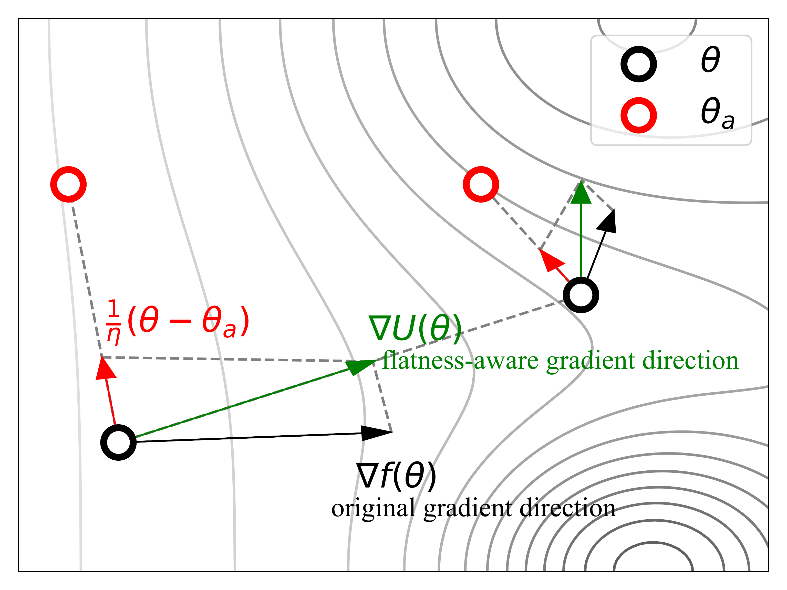

# Entropy-MCMC: Sampling from Flat Basins with Ease
[This paper](https://openreview.net/forum?id=oGNdBvymod) introduces Entropy-MCMC, a method for sampling from flat basins in the energy landscape of neural networks to pursue better generalization. Our method introduces an augmented parameter space to eliminate the need for costly inner loop for flatness computation. The experiments show that our method can achieve better performance than existing flatness-aware optimization, such as SAM and Entropy-SGD.



## Recommended Environment
```
python==3.8
pytorch==1.12
```

## Command
```
python exp/cifar10_emcmc.py
python exp/cifar100_emcmc.py
CUDA_VISIBLE_DEVICES=0,1,2,3 python exp/imagenet_emcmc.py
```

## Citation
```
@inproceedings{lientropy,
  title={Entropy-MCMC: Sampling from Flat Basins with Ease},
  author={Li, Bolian and Zhang, Ruqi},
  booktitle={The Twelfth International Conference on Learning Representations}
}
```
